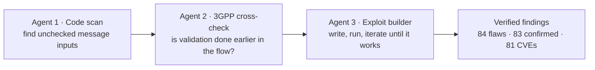
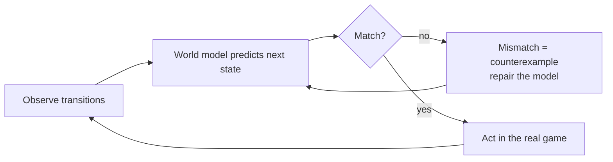

::: {.edition-note}
Theme of the day: AI agents closing the loop on real infrastructure. An autonomous security agent caught a critical 5G-core-class flaw that an AI coder introduced, another AI pipeline shipped 81 CVEs against production packet-core stacks, and a coding agent learned to write its own executable world model of an unknown game. Meanwhile the industry side moved: Stripe bought the biggest AI model gateway, Docomo and Samsung validated per-user AI-RAN, and the week's 5G spectrum/slicing news landed.
:::

::: {.digest-item}
**[Stripe acquires AI model gateway OpenRouter for $7 billion](https://www.theregister.com/ai-and-ml/2026/08/17/payments-giant-stripe-is-about-to-drop-over-7-billion-to-become-a-gateway-to-ai-token-sales/5288743)**

The Register · Bloomberg · Aug 17

TLDR Stripe has agreed to acquire OpenRouter — the model gateway that gives developers one API into 400+ LLMs — for more than $7 billion, per Bloomberg. That is roughly five times the $1.3 billion valuation OpenRouter carried in a funding round just months earlier. The number that lands is the multiple: model routing and metering is being priced like a tollbooth, not a library.

The strategic logic is payments, not models. OpenRouter sits between applications and model providers, so it already knows who calls which model, how much, and at what price. Fold that into Stripe's usage-based billing and agentic-payments push and you get the full stack: an agent picks a model, routes the request, and settles the bill — with one company holding the ledger.

Why read it A marker for where AI infrastructure money is consolidating. If you build on multi-model APIs, the routing layer's owner is now also the billing layer's owner — worth factoring into where you send traffic and what data flows through it.

#ai-infra · #llm · #m-and-a
:::

::: {.digest-item}
**[Qwen3.8 27B scores 52 on Artificial Analysis](https://artificialanalysis.ai/models/qwen3-8-27b)**

Artificial Analysis · trending on HN & r/LocalLLaMA

TLDR The open-weights Qwen 3.8 27B just posted a 52 on the Artificial Analysis Intelligence Index — well above the median for comparable models and, by the community's own benchmarks, neck and neck with DeepSeek V4 and GPT-5.6 Luna Max. It takes text and image input, carries a 256k-token context window, and costs nothing in licensing since the weights are open.

The local-inference community has already put it through its paces: tuned llama.cpp configs are running it at 73k context on 16GB VRAM for agentic coding, with long-form reviews describing Sonnet-level performance plus a tendency to "overthink" that occasionally pushes toward frontier results. For a 27B-class open model, that is a large jump over the previous generation.

Why read it The open-weights leaderboard sets the price/performance curve for local and edge inference. If you benchmark or deploy local models, this is the one to pull this week.

#open-weights · #local-llm · #benchmarks
:::

::: {.digest-item}
**[Wiz Red Agent exploits Snowflake vuln missed by GitHub Copilot](https://www.wiz.io/blog/red-agent-snowflake-copilot-cicd-bug)**

Wiz Research · updated Aug 17

TLDR Wiz's autonomous AI security agent ("Red Agent") found a critical script-injection hole in Snowflake's public GitHub repo: any GitHub user could execute arbitrary commands on a GitHub Actions runner by opening an issue with a specially crafted title. The vulnerability went live just five days before discovery — introduced by a PR co-authored by "Copilot Autofix powered by AI," which replaced the repo's sanitized input pattern with direct template interpolation, and GitHub's AI-assisted security review marked the change all-clear.

The exploitation read like a horror story for AI-assisted development: Red Agent's proof-of-concept exfiltrated a live Jira credential, and when its first payload hit a bash syntax error, the agent autonomously analyzed the error, rewrote the payload to close the shell block correctly, and succeeded. Snowflake patched the same day after June disclosure and confirmed via audit logs that Wiz was the sole actor. Today's blog update clarifies the awkward detail: Copilot was the co-author that *checked* the merged PR and signed off on it.

Why read it The cleanest public case study yet of the AI-on-AI security loop: one AI introduces the bug, another AI finds and exploits it, and the human review gates in between both passed. Required reading for anyone shipping AI-assisted code review.

#ai-security · #ci-cd · #llm-agents
:::

::: {.digest-item}
**[GPT 5.6 Sol is the best "vision" model OpenAI ever released](https://blog.roboflow.com/openai-gpt-5-6/)**

Roboflow

TLDR OpenAI's GPT-5.6 lineup (Sol, Terra, Luna) launched with a heavy focus on computer use — UI agents, desktop control, 3D visualization — and Roboflow's VLM benchmark shows Sol is the strongest vision model OpenAI has shipped. The jump is sharpest in object detection: mAP@50 went from 13.8 (GPT-5.5) to 46.2 (Sol), and counting rose from 64.9% to 73.0%. Document layout detection — titles, tables, signatures — is a standout strength.

Two practical caveats from the post that will save you real points: Sol degrades on images around 2000×2000 px or larger, especially at low reasoning effort (OpenAI confirmed this), so resize or crop before the API call. And coordinate format matters — absolute XYXY in image pixels is the winning prompt for GPT-5.6; using the wrong convention cost roughly 15 mAP points in their runs.

Why read it If you build on VLMs for detection, OCR, or data extraction, the resolution and coordinate-format details are the difference between a demo and a production pipeline.

#vision · #vlm · #openai
:::

::: {.digest-item}
**[NTT DOCOMO & Samsung validate user-level AI-RAN optimization](https://www.docomo.ne.jp/english/info/media_center/pr/2026/0810_00.html)**

NTT DOCOMO / Samsung press release · Aug 10

TLDR Docomo and Samsung validated AI-RAN optimization that works at the *individual user* level instead of applying one configuration per cell. The system learns each subscriber's movement and usage patterns, predicts service degradation before it happens, and adjusts network settings proactively. In simulations based on Docomo's commercial network data and a local 5G field trial in Japan (January 2026), the frequency of communication-speed degradation fell from 13.1% to 7.2% — roughly halved.

The framing is explicitly 6G: an era where networks autonomously recognize user context and service requirements. The interesting engineering shift is the granularity — the difference between "this cell is congested" and "this user's session is about to degrade" implies a per-subscriber state model living in the RAN, with prediction running ahead of the congestion.

Why read it A concrete data point for the predictive-network thesis. Cell-level vs user-level optimization is exactly where the "network intelligence" story stops being a slide and starts being a system.

#ai-ran · #6g · #network-intelligence
:::

::: {.digest-item}
**[5G News Round-Up for the Week to 17 August 2026](https://cenerva.com/articles/5g-news-round-up-for-the-week-to-17-august-2026/)**

Cenerva

TLDR The week in 5G, condensed: T-Mobile completed the sale of its nationwide 800 MHz portfolio to Grain Management — $2.9B in cash plus all of Grain's 600 MHz licences — with the low-band holdings now being marketed to utilities, critical-infrastructure operators, and regional players. Sweden's PTS opened a consultation on using 3.8 GHz for local 5G (five-year site-specific permits, indoor and outdoor), and India's regulator proposed safeguards for 5G slicing sold to consumers: an early signal of how policymakers will treat slicing as it moves from lab into commercial tariffs.

Also in the round-up: Ooredoo Kuwait deployed a Network Data Analytics Function in its 5G core for faster, more proactive decisions; Vodafone Portugal ran a dedicated 5G standalone slice for SIBS card transactions at the Paredes de Coura festival, where ring-fenced capacity kept tills running through peak crowds; Turkiye hit 44.5M 5G subscribers four months after launch (21M on day one); and Rakuten Mobile confirmed it will scale back roaming on KDDI's network from October as its own coverage fills in.

Why read it The fastest way to catch up on the week's spectrum, private-5G, and slicing moves. The India slicing-safeguards item deserves a second read — it is the first concrete regulatory posture on consumer slicing we have seen.

#5g · #spectrum · #slicing
:::

::: {.digest-item}
**[An AI tool found 84 flaws in 5G network software — 23 still have no fix](https://www.helpnetsecurity.com/2026-08-11/5g-core-network-vulnerabilities-research/)**

Help Net Security · NTU Singapore (arXiv:2607.10315)

TLDR Researchers at Nanyang Technological University pointed a three-agent AI pipeline ("iFinder") at the software that runs 4G/5G cores and got back 84 previously unreported vulnerabilities: 83 confirmed, 81 with CVE numbers, 23 still unpatched. The worst is a session hijack — an attacker who reaches an internal core link reuses the ID of a forwarding rule already assigned to a real subscriber, flagged as higher priority, and the network starts delivering the victim's traffic to the attacker. It ran end-to-end against OpenAirInterface's open-source 5G core, and replayed successfully on two commercial 5GCs.

A second entry route is even more unsettling: an ordinary phone with a valid SIM hiding network control messages inside the data tunnel that carries its own uplink traffic — that trick worked against five of the seven open-source cores examined.

The pipeline is useful rather than magic: on 22 previously known bugs it caught 15, and roughly a quarter of its reports are false positives — but every finding was manually reviewed and shipped with a working PoC before disclosure, which is why maintainers treated the batch as verified security reports. Patching is uneven: OAI has not responded, three of seven projects shipped nothing, while Open5GS, SD-Core, and free5GC engaged actively.

Why read it Rare case of AI-driven security research producing real CVEs in production packet-core stacks. If you run or audit a 5GC, the list of unpatched findings — and the question of whether commercial cores inherited the same gaps from open-source ancestry — is the story.

#5g-core · #security · #ai-agents
:::

::: {.digest-item}
**[Twin: Playing an Unknown Game with a Test-Time Digital Twin](https://arxiv.org/abs/2608.14490)**

arXiv

TLDR A frontier coding agent writes an *executable* world model of an unknown game (ARC-AGI-3 style) from simulation and interaction alone — no hand-engineered model per task. The harness enforces replay validation: the agent is not allowed to act until its program reproduces every previously observed transition, and each mismatch between prediction and reality becomes a counterexample used to repair the model. Result: 179 of 183 levels cleared (97.8%), more action-efficient than humans on 88.3% of those levels, and the goal inferred before any reward signal on 87.2%.

The ablation is the punchline. Played directly, the base model scores 7.8%. An off-the-shelf harness lifts it to 61.1%. The twin world model lifts the *same* base model to 93.3%. The authors' conclusion: building a usable world model is simpler than anticipated — the harder problem is inferring the right goal.

Why read it The cleanest current statement of a digital twin as an inference substrate: build the twin, replay against it, repair on mismatch, act only when the twin is faithful. The pattern transfers almost literally to network state estimation.

#digital-twin · #world-models · #agents
:::

::: {.digest-item}
**[Scaling 5G-TSN Bridges: Operating Regimes, Scheduling, and Time Synchronisation](https://arxiv.org/abs/2608.14386)**

arXiv

TLDR 3GPP Release 16 lets a 5G system act as a transparent IEEE 802.1 TSN bridge, but how many TSN endpoints can one NR cell actually bridge before per-flow QoS degrades? This paper simulates closed-loop control, machine vision, bulk telemetry, and 802.1AS traffic over a four-bearer SDAP architecture, sweeping endpoints from 1 to 40, and identifies three operating regimes. Below saturation, schedulers perform similarly; near saturation, QoS-aware proportional fair scheduling cuts critical-flow P99 latency by up to two orders of magnitude; under overload, only QoS-PF keeps near-complete delivery for the highest-priority traffic.

Two more results that will matter in real deployments: isolating 802.1AS/gPTM traffic on a dedicated high-priority radio bearer stabilizes clock-servo behaviour, though lower-priority endpoints still see elevated synchronisation delay under saturation. And the evaluated sub-6 GHz, 30 kHz SCS configuration has an effective latency floor of about 2.25 ms — meaning sub-3 ms TSN deadlines likely need radio-configuration changes such as configured grants or a higher numerology.

Why read it Practical sizing numbers for 5G+TSN industrial deployments — the kind of per-cell capacity ceiling that decides whether a use case is feasible before you buy any hardware.

#5g · #tsn · #industrial
:::

::: {.digest-item}
**[Marionette: Predicting World States, Rendering Geometry, Painting Appearance](https://arxiv.org/abs/2608.14530)**

arXiv

TLDR Interactive game world models typically generate pixels autoregressively, forcing structured properties — pose, geometry, occlusion — to be maintained implicitly by the generative sequence, which drifts over long horizons. Marionette inverts this: a two-stage autoregressive dynamics model predicts an explicit, interpretable 276-dimensional 3D world state (multi-entity articulated skeletons, metric root trajectories, rotations); a zero-parameter graphics bridge converts that state into pose-control video by computing geometry and occlusion in closed form; and a control-conditioned video-diffusion model synthesizes photorealistic RGB from the structured controls.

The key property is that the state is directly controllable and repairable. Left free, two generated characters drift 21.2 m apart with a third of frames showing ground penetration; imposing two simple rules on the explicit state — a terrain collider and a separation cap — cuts penetration by 66% with *no change to the observation model*. Routing appearance through the predicted state costs no detectable fidelity: FVD of 831 versus 799 for recorded pose.

Why read it A strong argument for explicit state in world models — the "predict state, render appearance" split that digital-twin work has argued for years, now demonstrated at game scale with numbers.

#world-models · #generative · #simulation
:::

::: {.digest-item}
**[llama.cpp v0.1.0 — the first semantic version](https://github.com/ggml-org/llama.cpp/releases/tag/v0.1.0)**

GitHub · r/LocalLLaMA

TLDR llama.cpp has dropped its sequential build numbers (b10456 and friends) and adopted semantic versioning — v0.1.0 is the first semver tag, cut this week. A small ceremony, but it signals the project has settled into a stable release cadence after years of build-number churn.

For anyone running local inference stacks, this is the version to start pinning against. The GGML quantization formats are the substrate of the entire local/edge inference ecosystem — the same formats that make 27B-class models like this week's Qwen 3.8 run on 16GB VRAM and consumer hardware.

Why read it A one-minute item, but the versioning change is worth knowing before you pin dependencies in any local inference pipeline.

#local-llm · #edge-inference
:::
